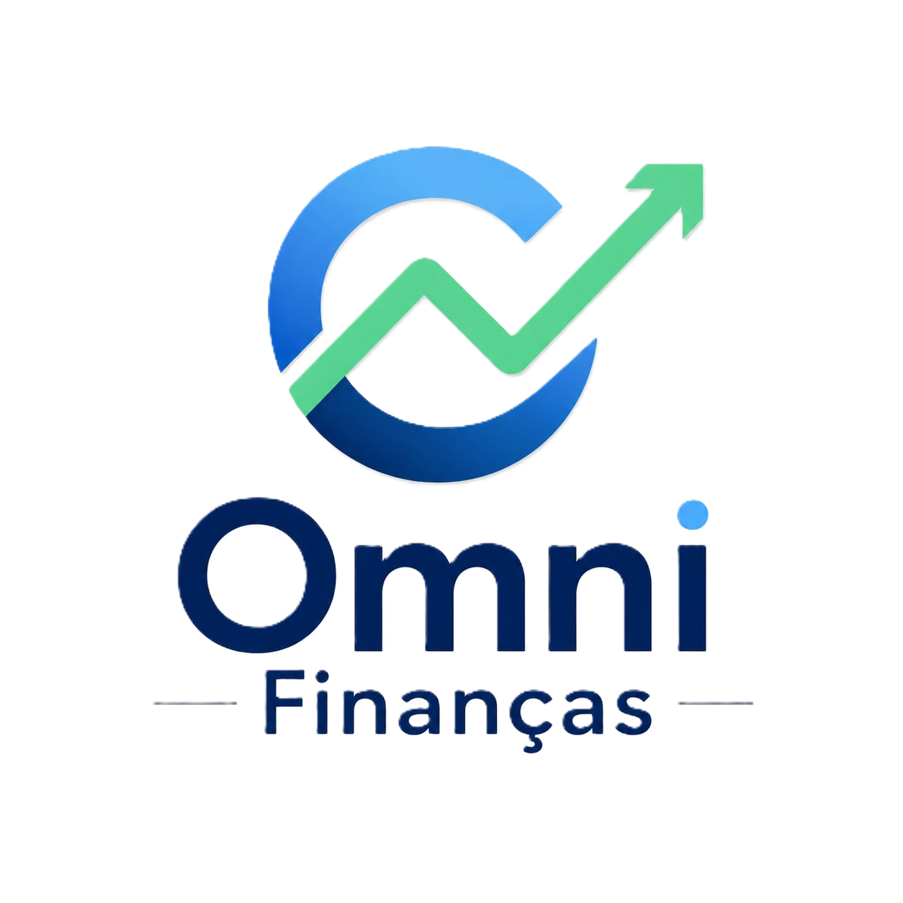
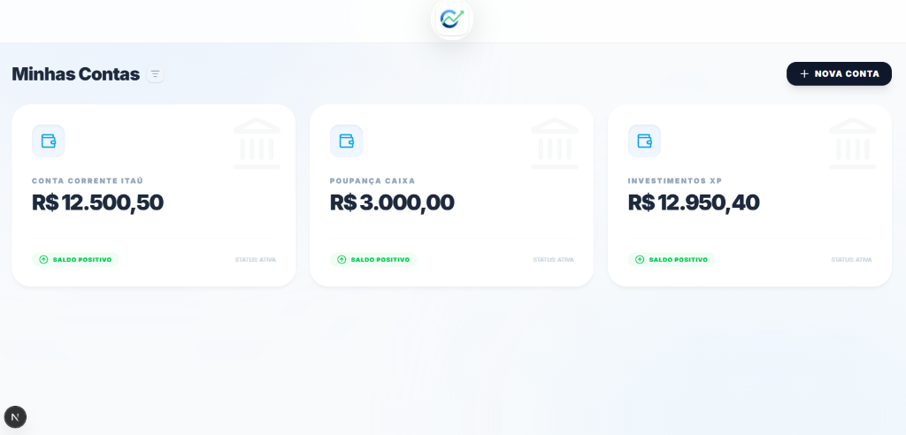
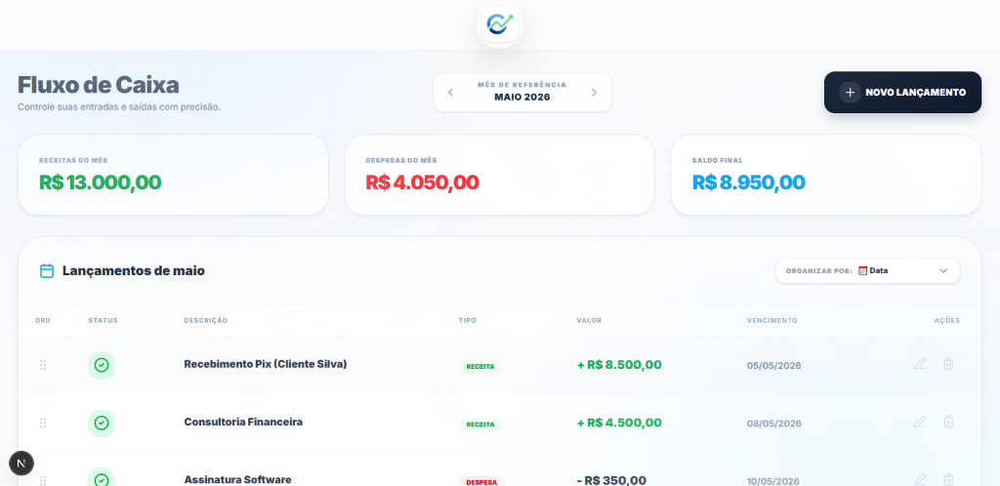

# 🚀 Omni Finanças - Inteligência para seu Dinheiro

  
  
<h3>Controle total, inteligência financeira e gestão simplificada em um único lugar.</h3>

   

  

    
  

  
  
<i>Acesse o ambiente de demonstração e explore todas as funcionalidades em tempo real.</i>

---

## 📸 Experiência Financeira Completa

### 📊 Dashboard Estratégico
Acompanhe os principais indicadores de performance (Saldo, Receitas, Despesas) com uma interface visual limpa, moderna e focada em resultados rápidos.

  

 

### 💳 Gestão de Cartões & Contas
Controle inteligente de múltiplas contas bancárias e faturas de cartão de crédito, com acompanhamento de limites e fechamentos em tempo real.

  
  

 

### 🔄 Fluxo de Caixa Inteligente
Controle suas entradas e saídas com precisão, com visualização clara de receitas, despesas e saldo final do período.

  

---

## ✨ Diferenciais do Ecossistema

- **Design Premium:** Interface moderna, intuitiva e totalmente responsiva para Mobile e Desktop (Glassmorphism).
- **Modo Sandbox / Vitrine:** Ambiente de demonstração seguro com proteção de dados e ações bloqueadas.
- **Transações Inteligentes:** Suporte completo para lançamentos recorrentes, parcelamentos e vinculação a cartões.
- **Experiência Fluida:** Animações sutis e transições rápidas projetadas para engajar o usuário.

---

## 🛠️ Stack Tecnológica

O **Omni Finanças** utiliza o que há de mais moderno no desenvolvimento web para garantir performance e escalabilidade:

- **Frontend:** Next.js 14+ (App Router)
- **Backend & Auth:** Context API (simulação local) / Preparado para Supabase
- **Estilização:** Tailwind CSS & Vanilla CSS
- **Iconografia:** Lucide React

---

## 📧 Contato Comercial & Desenvolvedor

**Carlos André** — *Especialista em Soluções SaaS*  

  
© 2026 Omni Finanças • Tecnologia para Finanças

