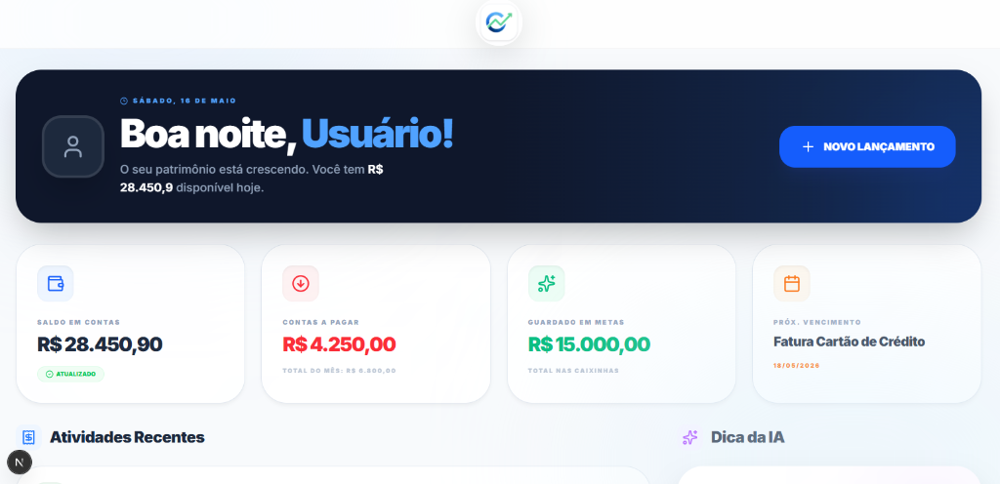
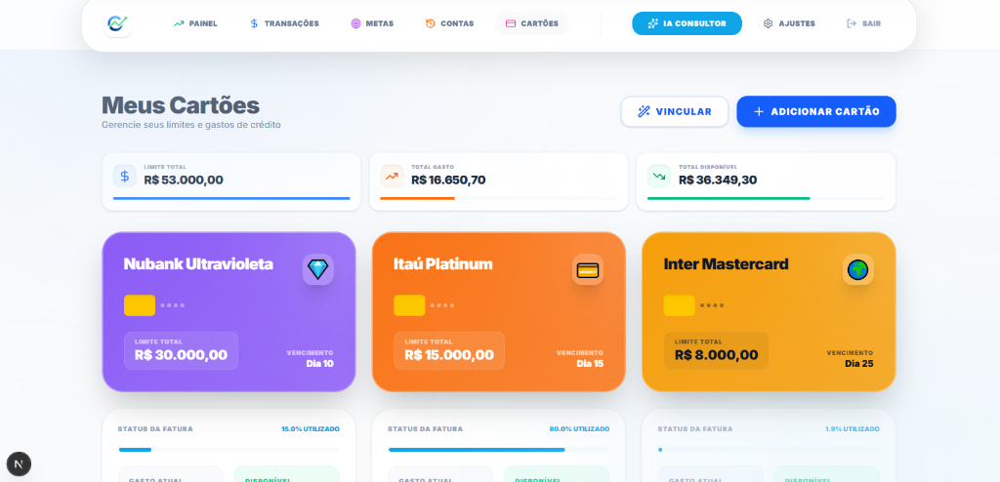

# 🚀 Omni Finanças - Inteligência para seu Dinheiro

**Controle total, inteligência financeira e gestão simplificada em um único lugar.**

 

<i>Acesse o ambiente de demonstração e explore todas as funcionalidades (Versão Read-Only).</i>

---

## 📸 Experiência Financeira Completa

### 📊 Dashboard Estratégico
Acompanhe os principais indicadores de performance (Saldo, Receitas, Despesas) com uma interface visual limpa, moderna e focada em resultados rápidos.

*(Adicione a imagem do dashboard aqui - `assets/screenshots/dashboard.png`)*
<!--  -->

 

### 💳 Gestão de Cartões & Contas
Controle inteligente de múltiplas contas bancárias e faturas de cartão de crédito, com acompanhamento de limites e fechamentos em tempo real.

*(Adicione a imagem de cartões aqui - `assets/screenshots/cartoes.png`)*
<!--  -->

 

### 🎯 Planejamento de Metas (Caixinhas)
Expanda seu patrimônio com gestão centralizada de objetivos, permitindo guardar dinheiro para viagens, reservas de emergência e compras específicas com barra de progresso visual.

*(Adicione a imagem de metas aqui - `assets/screenshots/metas.png`)*
<!--  -->

 

---

## ✨ Diferenciais do Ecossistema

- **Design Premium:** Interface moderna, intuitiva e totalmente responsiva (Mobile e Desktop) utilizando Glassmorphism.
- **Modo Sandbox / Vitrine:** Ambiente de demonstração imersivo totalmente seguro (cliques em formulários bloqueados, exibindo alertas da versão PRO).
- **Transações Inteligentes:** Suporte completo para lançamentos recorrentes, parcelamentos e vinculação a cartões.
- **Experiência Fluida:** Animações sutis e transições rápidas projetadas para engajar o usuário.

 

---

## 🛠 Stack Tecnológica

O **Omni Finanças** utiliza o que há de mais moderno no desenvolvimento web para garantir performance e escalabilidade:

- **Frontend:** Next.js 14+ (App Router) & React
- **Backend / BaaS:** Context API (simulação local) / Preparado para Supabase
- **Estilização:** Tailwind CSS & Vanilla CSS (Componentes Glass)
- **Animações:** Framer Motion
- **Iconografia:** Lucide React

 

---

## ✉️ Contato Comercial & Desenvolvedor

**Carlos André** — *Especialista em Soluções SaaS*

 

  © 2026 Omni Finanças • Tecnologia Financeira

